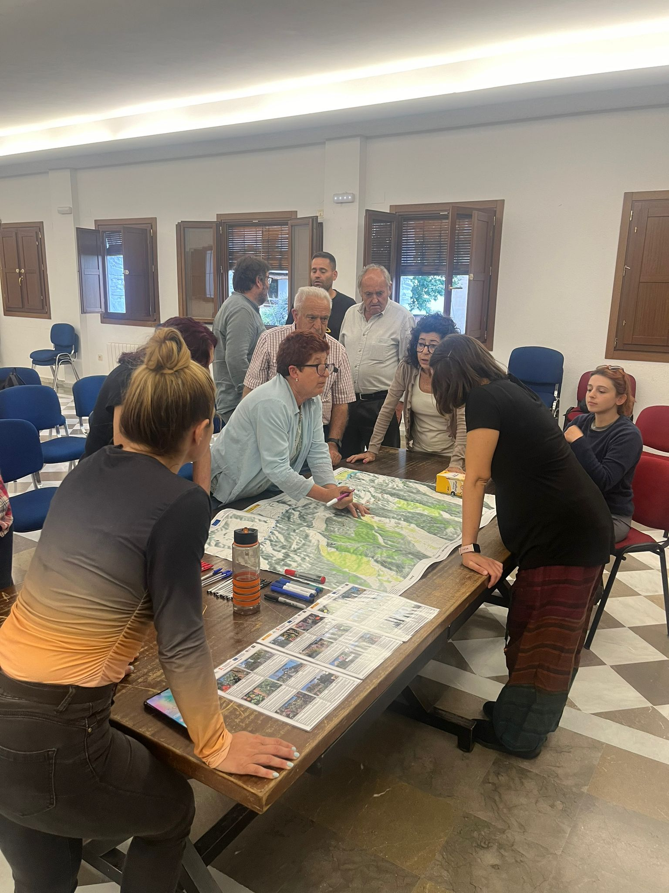

<!--StartFragment-->

Recientemente, tuve el privilegio de dirigir una charla en el encantador pueblo de **Pampaneira**, situado **en el corazón de la Alpujarra Granadina**, donde comunidad y ciencia se unieron en un diálogo fructífero sobre un desafío ambiental que nos afecta a todos: las especies invasoras. Este evento no solo fue una oportunidad para divulgar, sino también para aprender de la rica experiencia local.

En la charla, organizada por el Ayuntamiento de Pampaneira con el apoyo de la Universidad de Córdoba y la Delegación Territorial de Medioambiente en Granada, discutimos cómo especies como el ailanto están transformando nuestros paisajes locales. Más allá de los datos y estudios, lo que realmente enriqueció el evento fue el **intercambio de historias personales y preocupaciones de los residentes** de Pampaneira. Esta interacción reafirmó mi creencia en la necesidad vital de un enfoque colaborativo en la ciencia y la gestión ambiental.

Una de las lecciones más impactantes de esta experiencia fue ver cómo la información científica puede transformarse en acción comunitaria. Las preguntas y comentarios de los vecinos no solo reflejaron su comprensión de los temas discutidos, sino que también destacaron la urgencia de desarrollar **estrategias de gestión que resonaran con sus realidades diarias**.

Los retos que enfrentamos en la gestión de especies invasoras son complejos y multifacéticos. Sin embargo, eventos como este demuestran que el diálogo entre científicos y comunidades puede facilitar soluciones innovadoras y sostenibles. Estoy más convencida que nunca de que **nuestro progreso depende de estos encuentros**, donde la voz de cada individuo se valora y potencia.

Alentada por esta experiencia, insto a mis colegas científicos y a todos los interesados en la conservación del medioambiente a buscar y valorar estos espacios de diálogo. Solo a través de nuestro compromiso conjunto podemos esperar abordar efectivamente las amenazas a nuestra biodiversidad y, por ende, a nuestra calidad de vida.

Mi sincero agradecimiento a todos los que participaron y contribuyeron al éxito de esta charla, especialmente a **Esther Gutiérrez** por su invitación y organización, a **Borja Nebot** por su indispensable perspectiva y compromiso, y por supuesto, a mis compañeras **Sara Navarro** y **Katherine Onoszko** por estar ahí.

El camino hacia una gestión efectiva de las especies invasoras es largo y lleno de desafíos, pero está claro que la clave está en **la unión de esfuerzos**. Continuaré explorando y compartiendo estas experiencias en mi blog, esperando inspirar y ser inspirada por historias de compromiso y cambio.

<!--EndFragment-->

