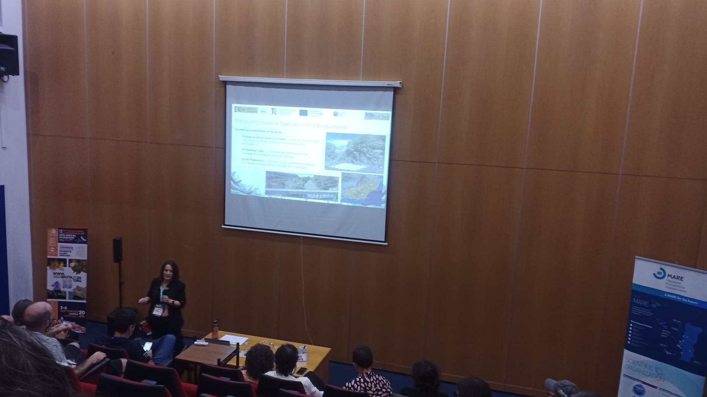

Last month, I had the opportunity to attend Neobiota 2024, a leading international conference focused on biological invasions. This was a fantastic platform to share key findings from my PhD research, conducted within the DesFutur project, which is centered on understanding the spatiotemporal dynamics of desertification in Southeastern Spain.

During the event, I presented our work titled "Incorporating Local Insights Through Interviews and a Participatory Workshop for Invasive Species Management in Southeastern Iberian Arid Ecosystems". This study delves into the perceptions of local stakeholders—land managers, officials, and specialists—on invasive species, derived from semi-structured interviews and a participatory workshop held in Granada. These interactions provided valuable insights into species prioritization and management needs in arid and semi-arid ecosystems, a region where ecological impacts of Invasive Alien Species (IAS) have been underexplored.

Key species highlighted in our study included *Cenchrus setaseus*, *Cortaderia selloana*, *Nicotiana glauca*, and *Ricinus communis*, with *Arundo donax* and *Ailanthus altissima* standing out for their socio-economic and environmental impacts. Stakeholders emphasized the need for non-chemical control methods and collaborative management strategies, alongside stronger legislative enforcement to curb the spread of invasive species. The participatory approach we implemented enhanced the relevance of our findings, ensuring that management recommendations were both scientifically informed and locally attuned.

**A Year of Learning and Growth**
This work is a core part of my doctoral thesis, and reflecting on this past year, I realize how much I’ve learned and how valuable the information gathered has been. Not only will it help shape the next stages of my thesis and the DesFutur project, but it has also been instrumental for my professional development and personal growth. Neobiota served as a platform to showcase the invaluable contributions from our stakeholders and to amplify some of their concerns in the scientific arena.

**Acknowledging Local Voices**
More than 100 local managers and stakeholders were contacted during this process, and nearly five dozen took part in the interviews. Without their input, this work would not have been possible. It’s easy to say, but considering the complexity of managing this topic on the ground—especially at the local level, with diverse priorities and challenges, and within the current socio-political context—this achievement must be acknowledged. For that reason, I want to extend my deep appreciation to all those involved, and I remain committed to continuing this important work.

**The Value of Networking and Feedback**
Beyond presenting our findings, Neobiota 2024 provided a unique opportunity to engage with experts from around the globe. Discussions on the current and future trends in IAS research opened new avenues for collaboration, particularly in addressing the socio-ecological challenges posed by invasive species. The feedback received from fellow researchers was invaluable and has been integrated into our work, refining our next steps within DesFutur.

Looking ahead, we remain committed to exploring the socio-ecological dynamics of invasive species in desertification-prone regions, building upon the collaborative networks and knowledge exchange initiated at Neobiota 2024.

Stay tuned for more updates as we continue our work on this critical issue.

