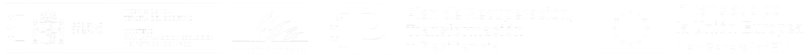

<!--StartFragment-->

Como parte de mi doctorado en la Universidad de Córdoba, estoy inmersa en el proyecto **DesFutur**, financiado por la **Fundación Biodiversidad**. Mi investigación aborda la dinámica espacio-temporal de la expansión e impacto de especies de flora invasora, un aspecto crítico en el contexto de la desertificación en el sudeste de la Península Ibérica. Utilizando técnicas avanzadas de modelado espacial y geoinformática, mi objetivo es predecir tendencias futuras y su impacto en los ecosistemas locales, contribuyendo al avance en la conservación del medioambiente y la gestión sostenible de los recursos naturales. 

<!--EndFragment-->

<!--StartFragment-->

## Resumen del Proyecto DesFutur

El proyecto DesFutur, liderado por la Universidad de Córdoba, se centra en contribuir al entendimiento y mitigación de la desertificación. Nuestra investigación se enfoca en evaluar la vulnerabilidad y capacidad de recuperación de los ecosistemas forestales del sudeste de la Península Ibérica frente al cambio climático. Identificamos puntos críticos y señales de alerta temprana, analizando la dinámica de tres factores fundamentales que impulsan la desertificación: el **decaimiento forestal** causado por eventos climáticos extremos, las **invasiones biológicas,** y los **incendios forestales**.

Cubrimos una extensa variedad de condiciones de aridez, colaborando estrechamente con **actores locales** en las provincias de Granada, Almería y Murcia. Nuestro enfoque combina técnicas avanzadas de investigación, incluyendo trabajo de campo y análisis de teledetección, para identificar patrones y simular posibles escenarios futuros. Esta información es vital para desarrollar estrategias eficaces que frenen la desertificación y minimicen sus impactos.

Además, DesFutur se inspira en el enfoque de la **ciencia traslacional**, buscando una interacción continua y productiva con agentes locales y responsables de la toma de decisiones. Este enfoque garantiza que nuestros hallazgos y recomendaciones sean pertinentes y aplicables en la gestión práctica y la toma de decisiones en materia de conservación.

<!--EndFragment-->

<!--StartFragment-->

## Introducción a la línea de trabajo de invasiones biológicas

La región sureste de la Península Ibérica se encuentra en una encrucijada ecológica, enfrentando el creciente desafío de las invasiones biológicas. Estos eventos críticos amenazan no solo nuestra diversidad biológica local, sino que también perturban las **funciones ecosistémicas** y tienen consecuencias socioeconómicas profundas. En DesFutur, abordamos de manera exhaustiva estas invasiones, analizando cómo la expansión de flora exótica invasora y los procesos de desertificación -agravados por el cambio climático y actividades humanas- están afectando nuestra biodiversidad única. 

<!--EndFragment-->

<!--StartFragment-->

## Objetivos de nuestra investigación

Nuestra investigación se enfoca en desentrañar la **dinámica espacio-temporal** de especies invasoras como el ailanto (*Ailanthus altissima*), el rabo de gato (*Pennisetum setaceum*), la caña común (*Arundo donax*), y diversas especies del género Opuntia. Mediante un análisis minucioso, nuestro objetivo es identificar los patrones y procesos clave que determinan la invasibilidad de los hábitats y la efectividad de las rutas de dispersión de estas especies. Este conocimiento nos permite desarrollar estrategias de gestión ambiental robustas y perdurables, destinadas a mitigar el impacto adverso de las especies invasoras en nuestros ecosistemas y comunidades. 

<!--EndFragment-->

<!--StartFragment-->

## Metodología

En DesFutur combinamos investigación de campo rigurosa con aplicaciones prácticas, adoptando un enfoque integrador que incluye tanto **observaciones en terreno** como análisis de **datos geoespaciales**. Esto nos permite identificar de forma efectiva las poblaciones de especies invasoras y evaluar el estado de sus hábitats. Utilizamos avanzadas técnicas analíticas, como el procesamiento de imágenes satelitales y el modelado geoespacial, para descifrar patrones de dispersión y prever futuros cambios bajo diversos **escenarios climáticos**. En última instancia, nuestra metodología busca generar información valiosa para informar las políticas de manejo y conservación, contribuyendo a la protección de la biodiversidad y los ecosistemas de nuestra región. 

<!--EndFragment-->

<!--StartFragment-->

## Resultados y Aplicación Práctica

Las proyecciones futuras sobre la expansión de especies invasoras son clave para la gestión y conservación del territorio. DesFutur **integra a gestores y partes interesadas desde el principio**, garantizando la relevancia y practicidad de nuestros hallazgos. Más allá de los modelos y simulaciones, nuestro enfoque se centra en cómo estos resultados se transforman en herramientas eficaces para quienes administran nuestros paisajes y recursos naturales. La colaboración estrecha con autoridades ambientales, gestores del territorio y agentes locales es fundamental en nuestra estrategia, asegurando que las soluciones propuestas se alineen con las necesidades y realidades locales. 

<!--EndFragment-->

<!--StartFragment-->

## ¿Eres un Gestor o Actor Local Listo para Marcar la Diferencia?

En un espíritu de colaboración activa, invitamos a gestores del territorio, gestores de carreteras, planificadores urbanos, agricultores y otros agentes locales a participar en talleres y sesiones informativas que organizaremos. Estos eventos servirán de plataforma para discutir nuestros hallazgos, explorar aplicaciones prácticas y co-crear estrategias de gestión adaptadas a las necesidades específicas de nuestras comunidades y ecosistemas. Este llamado a la acción busca unir esfuerzos y experiencias para enfrentar los retos de las especies invasoras, trabajando juntos hacia un futuro donde la integridad de nuestros ecosistemas se refuerce para las generaciones futuras.  

### Mantente Informado y Conectado

Para estar al tanto de estos eventos y otras iniciativas relacionadas con el proyecto DesFutur, te animo a:

* Visitar regularmente la página web del proyecto DesFutur: Aquí encontrarás actualizaciones, información sobre eventos próximos y recursos relevantes.
* Consultar mi sección **SciComm** en esta web: Donde compartiré información detallada, análisis y reflexiones sobre los avances del proyecto, así como detalles sobre talleres y actividades de divulgación.
* Contactarnos directamente para recibir actualizaciones: Si estás interesado en recibir información específica sobre próximos eventos o colaboraciones, no dudes en enviarnos un correo electrónico. 

<!--EndFragment-->

