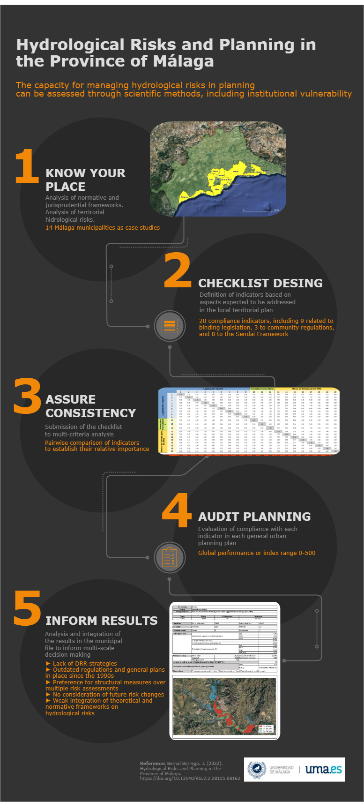

Málaga se sitúa en una de las regiones mediterráneas más amenazadas por los riesgos asociados al cambio climático, entre ellos los relacionados con el agua. Así lo reconoce la legislación europea, estatal y autonómica y sobre todo, así lo demuestran de manera evidente los cada vez más frecuentes e intensos episodios torrenciales, de inundaciones y de sequías que afectan de forma directa al ámbito ecológico, social y económico malagueño. Demostrada ya la interferencia del desarrollo urbanístico y social durante las últimas décadas, se hace necesario partir del conocimiento científico y tecnológico e incorporar éste al ordenamiento territorial y la planificación urbanística.

Es cierto que en la sociedad actual el riesgo cero, ya sea este natural, inducido o tecnológico, no existe, y esto es algo que hemos asumido desde tiempos remotos. Ahora bien, no todas las unidades territoriales presentan el mismo nivel de tolerancia ycapacidad del riesgo, al igual que no todos los planificadores han tomado las mismasdecisiones de desarrollo urbanístico, o en otras palabras, no todos han asumido unmismo apetito de riesgo. Teniendo en cuenta la información disponible, la forma en que este riesgo se gestiona a lo largo del tiempo es fundamental para garantizar la seguridad de las personas y el medioambiente, en definitiva su medio de vida, ante la eventualidad de un suceso de potenciales consecuencias catastróficas, a menudo irreversibles. De la misma forma, teniendo en cuenta los largos plazos de aprobación y vigencia de los planes generales urbanísticos, es importante que el planeamiento vigente sea objeto de escrutinio para comprobar si el mismo ofrece, y hasta qué punto, garantías de protección frente a los riesgos hidrológicos presentes en el territorio.

El objetivo principal del presente proyecto es definir el grado o capacidad de desempeño del planeamiento urbanístico municipal en la protección frente a riesgos hidrológicos a través del estudio de aquellos términos municipales con una mayor vulnerabilidad y exposición. 

